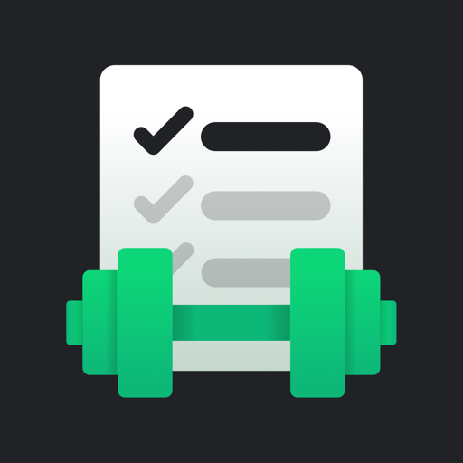

<p align="center">
  
</p>

<h1 align="center">LiftBook</h1>

<p align="center">
  A workout log for Android that never leaves your phone.
</p>

---

LiftBook is a single-user workout tracker written in Kotlin and Jetpack Compose. Everything is
stored on the device. There are no accounts, no sync and no backend, and the app declares no
network permission, so it works the same in airplane mode as anywhere else.

## Features

**Exercise library**
- 129 built-in exercises, each with a primary muscle group, equipment and type
- Custom exercises. Deleting one archives it, so past workouts that used it stay intact
- Search by name, filter by muscle group and equipment
- Each exercise has a page with its full history and the values from last time

**Routines**
- Templates with an ordered list of exercises and default sets, reps and weight
- Edit, reorder, duplicate and delete. Each routine shows when you last did it
- Start a workout from a routine with every set already filled in

**Active workout**
- Start empty or from a routine. Only one workout runs at a time
- Log weight × reps, reps only, or time and distance, depending on the exercise
- Sets are pre-filled from the last time you did that exercise
- Set types: normal, warm-up, drop set and failure. Warm-ups don't count toward volume or PRs
- A rest timer starts when you complete a set. It alerts with a notification and vibration,
  even with the screen off
- Autosaves on every change. If the app is killed, the workout is there when you reopen it
- Finishing shows a summary: duration, volume, completed sets and any new PRs

**History and progress**
- Paged history of every workout, plus a calendar of training days
- Open, edit or delete any past workout. Volume and PRs are recalculated
- Charts per exercise for estimated 1RM, max weight and volume, over 1M / 3M / 6M / 1Y / all
- PRs detected automatically (heaviest weight, most reps at a weight, best estimated 1RM),
  flagged during the workout and in history
- A weekly summary with workouts, volume and sets per muscle group
- An optional body-weight log with a 7-day trend

**Reminders**
- A weekly schedule: days, a start time and an optional routine
- A notification before each workout, with Start now, Snooze and Skip today
- No reminder while a workout is in progress, or once you've trained that day
- Rescheduled after a reboot, an app update, or a clock or time-zone change

**Settings and data**
- Default rest time, first day of the week, and light, dark or system theme
- Export everything to one JSON file through the system file picker
- Import a backup, choosing merge or replace
- Clear all data, with a two-step confirmation

Weights are stored in kilograms and distances in kilometres. There is no pound or mile setting
yet. The unit toggle in FR-6.1 was left out on purpose.

## Privacy

- **No network access.** The manifest has no `INTERNET` or `ACCESS_NETWORK_STATE` permission,
  and it removes them if a library ever tries to merge them in.
- **No cloud backup.** Android Auto Backup is off (`allowBackup="false"`), so the database is
  never copied to a Google account. The JSON export is the only way to back up.
- **No analytics, crash reporting or remote content** of any kind.

## Requirements

- Android 8.0 (API 26) or newer. The target is API 37
- To build it: Android Studio with JDK 17 or newer (the bundled JDK works)

## Build and run

```bash
./gradlew assembleDebug                # build
./gradlew installDebug                 # build and install on a connected device
./gradlew testDebugUnitTest            # unit, repository and Compose UI tests (Robolectric)
./gradlew connectedDebugAndroidTest    # instrumented tests on a device
./gradlew lint                         # Android lint
```

The debug build installs as **LiftBook Debug** (`com.example.liftbook.debug`), next to the release
build, so testing never touches your real log.

Test the rest timer and reminders on a real phone if you can. Doze and exact alarms don't behave
the same on the emulator.

### Signed release builds

Release signing reads a `keystore.properties` file in the repository root. It is gitignored and
must never be committed:

```properties
storeFile=/absolute/path/to/liftbook.jks
storePassword=…
keyAlias=…
keyPassword=…
```

Then run `./gradlew assembleRelease`. Without the file the release build still works, it just
isn't signed.

## Tech stack

| Area | Choice |
| --- | --- |
| UI | Jetpack Compose, Material 3, system font only |
| Architecture | MVVM with `StateFlow` and immutable UI state, one activity |
| Navigation | Navigation Compose with type-safe routes |
| Storage | Room for workout data, Preferences DataStore for settings |
| DI | Hilt |
| Async | Kotlin coroutines and Flow |
| Lists | Paging 3 for history |
| Timers and reminders | `AlarmManager` exact alarms and `NotificationManager` |
| Charts | Drawn by hand with Compose `Canvas`, no chart library |
| Backup | kotlinx.serialization, versioned JSON |
| Tests | JUnit4, Turbine, Robolectric, Compose UI tests |

Dependency versions live in the version catalog at `gradle/libs.versions.toml`.

## Project layout

```
app/src/main/java/com/example/liftbook/
├── core/            formatting, time and unit helpers
├── domain/          plain Kotlin models, repository interfaces, calculators
│                    (volume, estimated 1RM, PR detection, weekly summary)
├── data/            Room database, DAOs, the exercise seed, DataStore,
│                    JSON backup, repository implementations
├── di/              Hilt modules
├── notification/    rest timer and reminder alarms, receivers, channels
└── ui/
    ├── theme/       colours, type scale, spacing tokens
    ├── components/  shared design system
    ├── navigation/
    └── feature/     one package per screen group: exercises, routines, workout,
                     summary, history, progress, reminders, settings, home
```

Room schemas are exported to `app/schemas/`, and every migration has a test.

## Documentation

- [`docs/requirement.md`](docs/requirement.md) is the spec. Each requirement has a stable ID
  (`FR-x.y`, `NFR-n`) that commits and code comments refer to.
- [`docs/architecture.md`](docs/architecture.md) covers the package layout, data model,
  navigation graph and ViewModels, the build order, and the open questions with the decisions
  made on each.
- [`CLAUDE.md`](CLAUDE.md) sets out the conventions, the domain rules and the design standard
  the app is held to.

## Contributing

Commits follow Conventional Commits and cite the requirement they implement, for example:

```
feat(workout): rest timer (FR-3.5)
```
